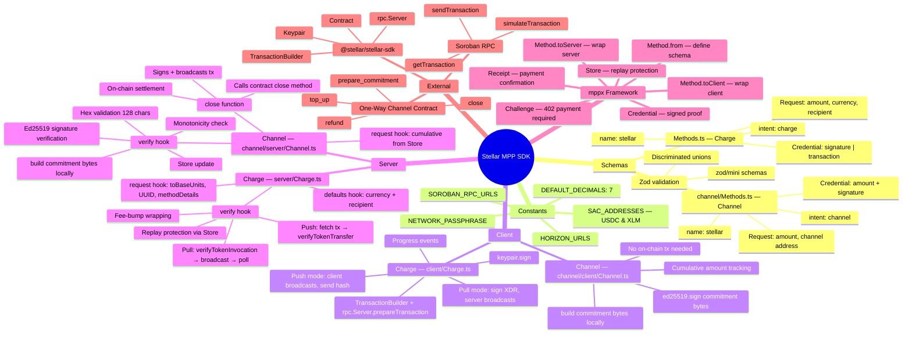

# Stellar MPP SDK — Mindmap

```mermaid
mindmap
  root((Stellar MPP SDK))
    Schemas
      Methods.ts — Charge
        name: stellar
        intent: charge
        Credential: signature | transaction
        Request: amount, currency, recipient
      channel/Methods.ts — Channel
        name: stellar
        intent: channel
        Credential: amount + signature
        Request: amount, channel address
      Zod validation
        zod/mini schemas
        Discriminated unions
    Constants
      NETWORK_PASSPHRASE
      SOROBAN_RPC_URLS
      HORIZON_URLS
      SAC_ADDRESSES — USDC & XLM
      DEFAULT_DECIMALS: 7
    Client
      Charge — client/Charge.ts
        Pull mode: sign XDR, server broadcasts
        Push mode: client broadcasts, send hash
        TransactionBuilder + rpc.Server.prepareTransaction
        keypair.sign
        Progress events
      Channel — channel/client/Channel.ts
        build commitment bytes locally
        ed25519.sign commitment bytes
        Cumulative amount tracking
        No on-chain tx needed
    Server
      Charge — server/Charge.ts
        defaults hook: currency + recipient
        request hook: toBaseUnits, UUID, methodDetails
        verify hook
          Pull: verifyTokenInvocation → broadcast → poll
          Push: fetch tx → verifyTokenTransfer
          Fee-bump wrapping
          Replay protection via Store
      Channel — channel/server/Channel.ts
        request hook: cumulative from Store
        verify hook
          Hex validation 128 chars
          Monotonicity check
          build commitment bytes locally
          Ed25519 signature verification
          Store update
        close function
          On-chain settlement
          Calls contract close method
          Signs + broadcasts tx
    mppx Framework
      Method.from — define schema
      Method.toClient — wrap client
      Method.toServer — wrap server
      Challenge — 402 payment required
      Credential — signed proof
      Receipt — payment confirmation
      Store — replay protection
    External
      @stellar/stellar-sdk
        Keypair
        Contract
        rpc.Server
        TransactionBuilder
      Soroban RPC
        simulateTransaction
        sendTransaction
        getTransaction
      One-Way Channel Contract
        prepare_commitment
        close
        top_up
        refund
```
